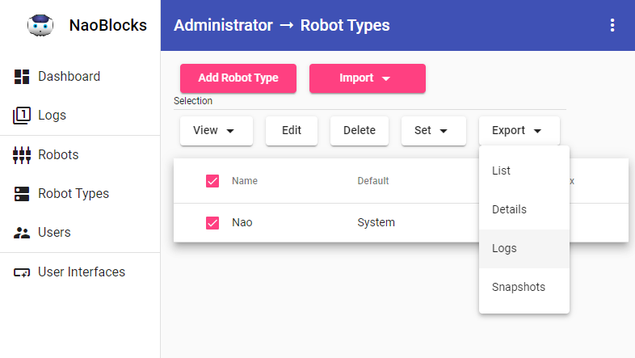
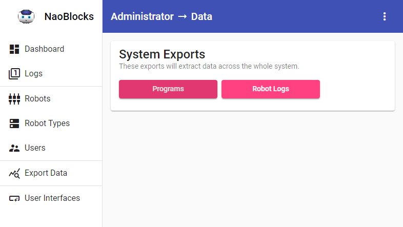

# Data

As the NaoBlocks system is a research project, it offers a variety of data exports.

## Robot Logs

You can download all the robot logs for either a robot type or across the whole system.

To download all the logs for a robot type, change to the *Administrator* role and select *Robot Types*. Then select the robot you want to export the logs for, and select `Logs` from the `Export` button:

To download all logs across the system, change to either the *Teacher* or *Administrator* roles and select *Export Data*. The select the `Robot Logs` button:

## Programs

You can download all the programs that have been sent to the server,  across the whole system.

To download all programs across the system, change to either the *Teacher* or *Administrator* roles and select *Export Data*. The select the `Programs` button:

