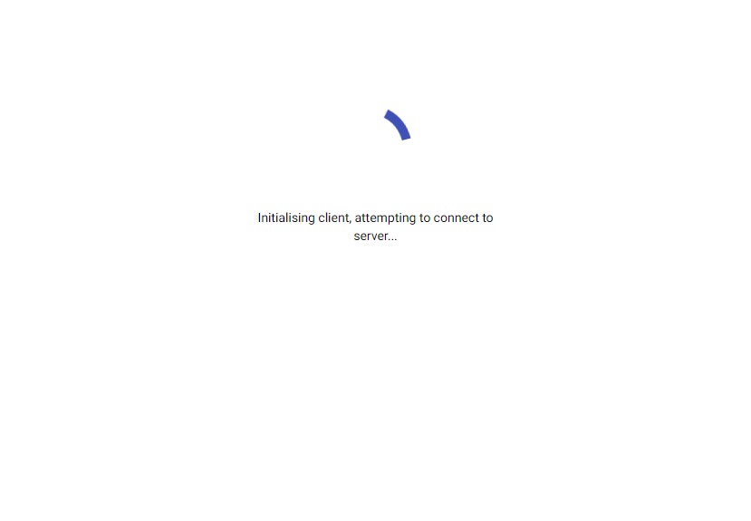
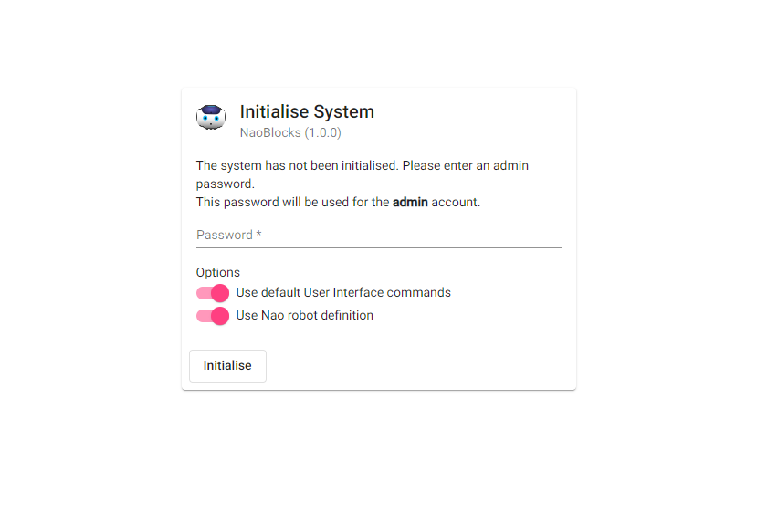
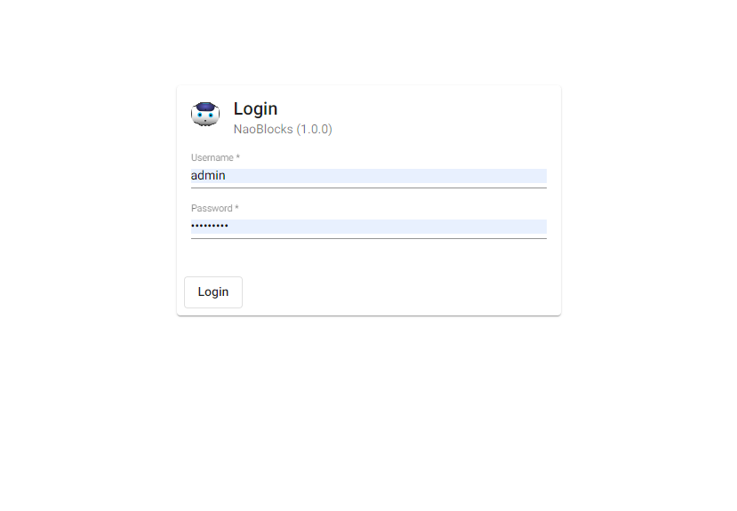

# Running NaoBlocks.Net

Currently, running NaoBlocks.Net assumes you are familiar with programming and have some knowledge of Visual Studio. 

## Getting the Code

You will need to download the code from the repository to a machine. Then, open the [Solution file](../NaoBlocks.sln) and build it. Assuming everything goes right, the build should download all the required dependencies and produce the binaries. If not, then get in touch with me. *(Yes, adding an installer is on the TODO list.)*

Once you have built the code, you can then run it. I suggest running it from Visual Studio: that way you can fix things if required.

When you first start the application, you will see the loading screen:

This screen is normal when you start the application. In the background, the server is starting the database system and initialising all the required components. Therefore, it may take a few seconds to start up.

## Running the Server for the First Time

The first time you run the server, you will be asked to initialise the system:

This screen provides some basic options for starting the system. The only **required** element is the administrator password. The other options provide a streamlined start up process, so you don't have to know about the configruation settings. If you need to change these later, it is possible to do so using the administrative functionality.

**Important Note:** There is currently a bug in the initialisation code. Once you have clicked on Initialise, you will need to refresh the browser to load the correct settings (Ctrl-F5 in most browsers.)

## Logging on

Once the server has been initialised, you can logon:

Use the admin password you set in the initialisation step.