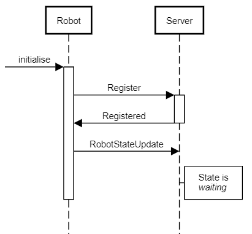
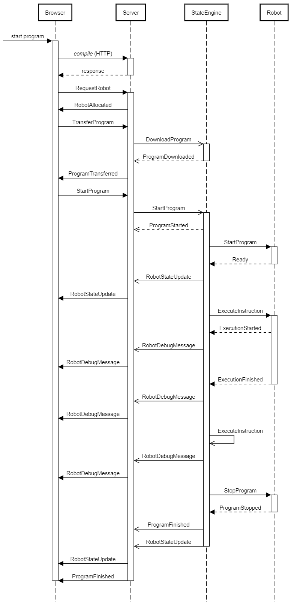

# Socket Protocol

This document specifies the communications protocol used for communciations between a robot and the server when using low-level sockets.

## Overview

Each message has the following header:

Start Position | End Position | Length | Purpose | Values
---: | ---: | ---: | --- | ---
0 | 1 | 2 | Message type | See below.
2 | 3 | 2 | Sequence number | The sequence number of the message. This number starts at 0 and goes up to 65536, then loops back to 0 again.

All multi-byte numbers are stored in little-endian format. The first byte is the least significant, followed by the more significant bytes (see [Wikipedia](https://en.wikipedia.org/wiki/Endianness).)

After the header, the data is sent in an UTF-8 encoded string. The maximum length of the data is 1,024 bytes. The data is terminated by a zero byte.

## Command Sequences

These sequences are used at specific times in the communications process.

### Initialisation

When the robot first starts, it will need to authenticate with the server and register its details.

### Execution

This sequence is triggered by the server when a user requests the execution of a program.

### State update

The robot may send a state update at any time.

## StateEngine

Many of the robots that use socket communications will not have the processing capacity to maintain an in-memory version of the program. The `StateEngine` component gets around this issue by storing the state of the robot on the server (or a proxy) instead.

The `StateEngine` stores an in-memory representation of the execution state. It will update the state based on each execution step and send commands as required to the robot.

Each `StateEngine` instance is started when program execution is requested and disposed when execution completes. The state is not persisted between execution instances.

## Commands

These commands are defined in `ClientMessageType` in `NaoBlocks.Common` ([link](../Common/NaoBlocks.Common/ClientMessageType.cs).) This documentation explains how they are implemented in the socket protocol.

**Note:** Specific robot implementations may implement these commands slightly differently depending on the capacities available.

### Authenticate

**Number:** 1

Send the client credentials to the server

### Authenticated

**Number:** 2

Credentials are valid

### RequestRobot

**Number:** 11

Request a robot to run a program on

### RobotAllocated

**Number:** 12

Allocate a robot to the client

### NoRobotsAvailable

**Number:** 13

There are no clients available

### TransferProgram

**Number:** 20

Request the server to inform the robot to download a program

### ProgramTransferred

**Number:** 21

Reply from the server when the robot has finished downloading

### DownloadProgram

**Number:** 22

Request the robot to download a program

### ProgramDownloaded

**Number:** 23

The robot has finished downloading the program

### UnableToDownloadProgram

**Number:** 24

The program cannot be downloaded to the robot

### StartProgram

**Number:** 101

Start execution of a program

### ProgramStarted

**Number:** 102

Program execution has started

### ProgramFinished

**Number:** 103

Program execution has finished

### StopProgram

**Number:** 201

Request cancellation of a program

### ProgramStopped

**Number:** 202

Program has been cancelled

### RobotStateUpdate

**Number:** 501

 An update from the robot about its state

### RobotDebugMessage

**Number:** 502

 A debug message from the robot (normally a step has started)

### RobotError

**Number:** 503

An error that occurred during execution of a program

### Error

**Number:** 1000

A general error (e.g. message type not recognised)

### NotAuthenticated

**Number:** 1001

The client has not been authenticated

### Forbidden

**Number:** 1002

The client is not allowed to call the functionality

### StartMonitoring

**Number:** 1100

Start monitoring all client changes

### StopMonitoring

**Number:** 1101

Stop monitoring all client changes

### ClientAdded

**Number:** 1102

A new client has connected to the system

### ClientRemoved

**Number:** 1103

An existing client has disconnected

### AlertsRequest

**Number:** 1200

Requests all current notifications on the robot

### AlertBroadcast

**Number:** 1201

An alert is being broadcast to all listeners
