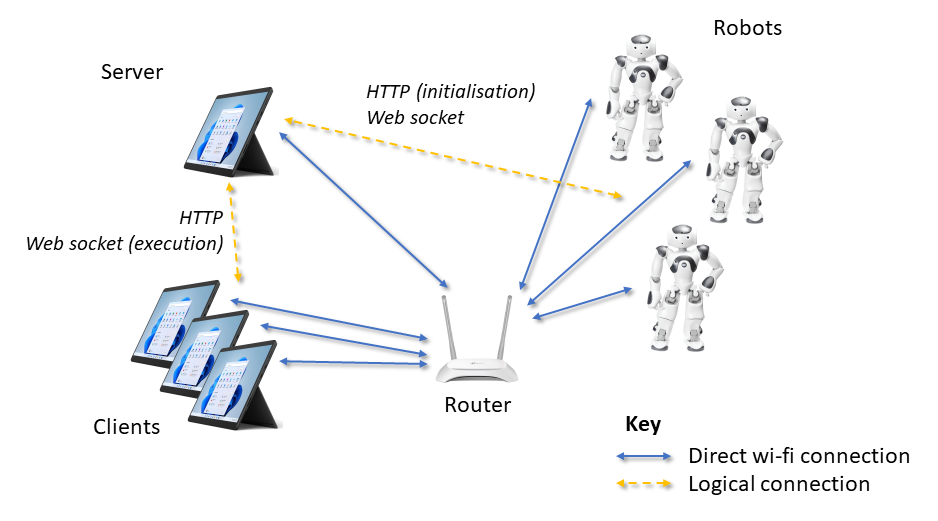

# Topographies

To simplify the deployment and testing of NaoBlocks, we have developed some basic topographies. 

**Note:** These are specific to Waipapa Taumata Rau - The University of Auckland.

## Topography 1

This topography assumes the use of a single WiFi router, one Surface Pro as the server, and all other devices contecting as clients.



### WiFi router

The router for this topography should broadcast its SSID as `naoblocks`.

### Machines

Friendly Name | Machine Name |IP Address | Tag Number | Server Name
--- | --- | --- | --- | ---
Surface 1 | EN412301 | 192.168.0.151 | UOA412301 | one.naoblocks.nz
Surface 2 | EN412304 | 192.168.0.152 | UOA412304 | two.naoblocks.nz
Surface 3 | EN412303 | 192.168.0.153 | UOA412302 | three.naoblocks.nz
Surface 4 | EN412303 | 192.168.0.154 | UOA412303 | four.naoblocks.nz

***Note:** the assigned IP addresses assume the router labelled `robotics` is being used. Any other router will arbitarily allocate IP addresses.*

Any of the machines can be used as the primary server. However, it is best to have a single machine as the primary server, with all other machines and robots connecting to it. This approach allows the storage of data in one single location.

Additional machines can be added as clients if desired. These will have arbitary IP addresses allocated by the WiFi router.

#### Windows configuration

By default, the server names above will **not** work. To enable these names, you will need to modify the `hosts` file on each Windows client machine. To do this, open `C:\Windows\System32\drivers\etc\hosts`, then add the following lines:

```
192.168.0.151   one.naoblocks.nz
192.168.0.152   two.naoblocks.nz
192.168.0.153   three.naoblocks.nz
192.168.0.154   four.naoblocks.nz
```

### Robots

Friendly Name | Machine Name | IP Address | Tag Number
--- | --- | --- | ---
Plum       | Black1 | 192.168.0.171 | UOA400482
Cherry     | Red3   | 192.168.0.172 | UOA382905
Apple      | Red1   | 192.168.0.173 | UOA382903
Blueberry  | Blue1  | 192.168.0.174 | UOA382907

***Note:** the assigned IP addresses assume the router labelled `robotics` is being used. Any other router will arbitarily allocate IP addresses.*
