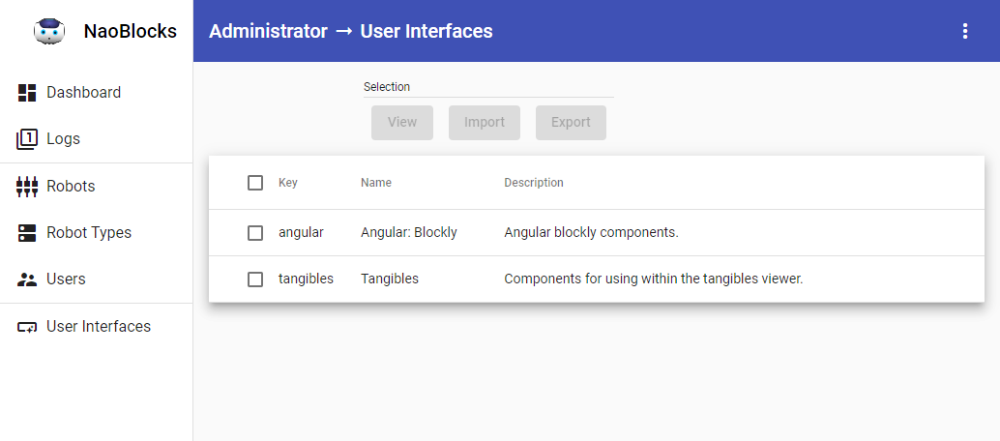
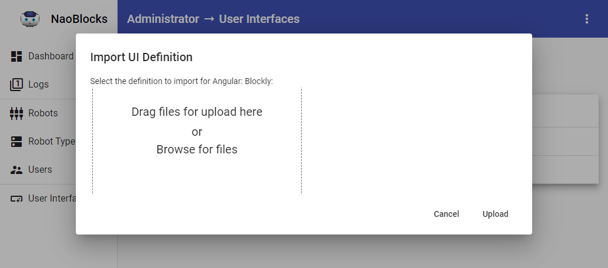
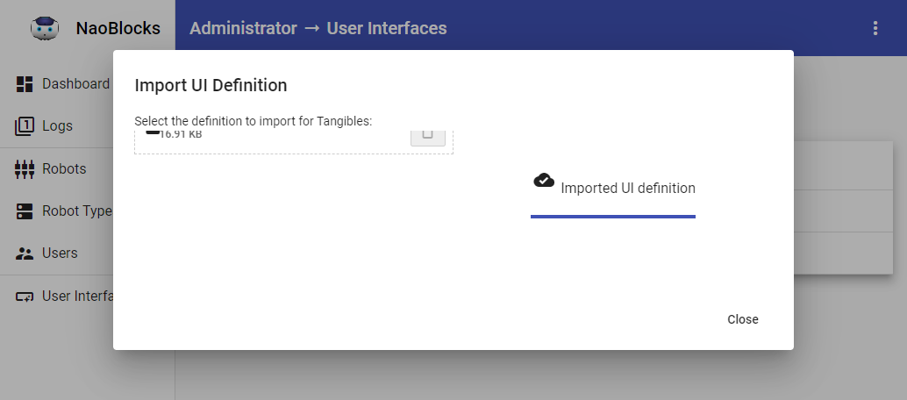

# User Interfaces
NaoBlocks.net currently contains two user interfaces. Both of these are defined by uploading a JSON file containing the definition.

## Angular Interface
The Angular interface uses a Blockly editor. It consists of four main components:
1. **Block definitions:** these are the individual blocks that can be used in the editor. They are one of two types: SYSTEM (uses the default Blockly definition) or a custom block. Custom blocks are defined using JSON (see [https://developers.google.com/blockly/guides/create-custom-blocks/define-blocks]().)
1. **Language definition:** this will convert from the Blocks to NaoLang. It uses the default Blockly code generation via a custom language generator (see [https://developers.google.com/blockly/guides/create-custom-blocks/generating-code]().)
1. **AST converters:** these will convert from a NaoLang Abstract Syntax Tree (AST) to a Blockly DOM. The converted DOM can then be loaded into the Blockly editor. In future, these will be used to save and restore programs. ***Note:** this feature has not been implemented yet.*
1. **Robot toolboxes:** these define which blocks can be used to build a program for a robot type. A robot type can have multiple toolboxes.

The first three components are defined in the JSON file. The robot toolboxes can be defined either via the user interface (under *Administrator*, *Robot Types*) or by uploading an XML definition.

## Tangible Interface

The tangible interface recognises phyiscal blocks with TopCodes codes on them (see [https://github.com/TIDAL-Lab/TopCodes]().) The web-based version uses the video camera via the browser. There are two main components:
1. **Block definitions:** the definitions of the blocks. These include the TopCodes number, text, image, and code generator (unlike Angular these are downloaded in a single definition.)
1. **Common images:** the images are stored as Base64 encoded PNG files. If an image is used by multiple blocks it is more efficient to store them as a common image and reference the image from the block.

**Notes:**
* While the interface works, it has some issues. Potentially we could look at changing to a different visual coding system in future (maybe Aruco markers - see [https://github.com/jcmellado/js-aruco]().)
* The images can only be PNG images currently. However, this limitation could be easily removed by just changing the validation. Potentially we could move to some other encoding by allowing in more file types (I would still keep the Base64 encoding, it allows us to embed the images in the upload file.)

## Uploading a Definition

The simplest way to upload a new definition is via the user interface. Start up the web server and login with an administrator account. Then change to the *Administrator* role and select *User Interfaces*:

This list displays all the user interfaces. No, it is not possible to add a new interface, as these are programmed into the system.

The next step is to select an interface and click on Import:

This dialog will allow you to select the definition to import (yes, there are some issues with the interface styling. But it works so fixing the styling is low priority.)

Select the file to upload (either drag-and-drop or clicking and navigating to the file in the system explorer.) Then click on **Upload**. If everything works successfully (and your file is valid), you will see a success message:

Otherwise, the dialog will display a list of errors that need to be fixed before the upload will work (also badly styled.)

**Note:** you will need to refresh your browser after a new interface definition has been uploaded. Because of the way the definitions are loaded, they are not automatically refreshed.

## Unified Definition
Currently, we have one definition file per interface. While this approach made sense when the interfaces were under development (the Angular Interface is more mature), it is becoming painful to manage two different sets of interface definitions.

The next step is to build a unified definition that contains both definitions, and some tooling to split them into seperate files.

This is currently a work in progress. I will add more details once I have it working.