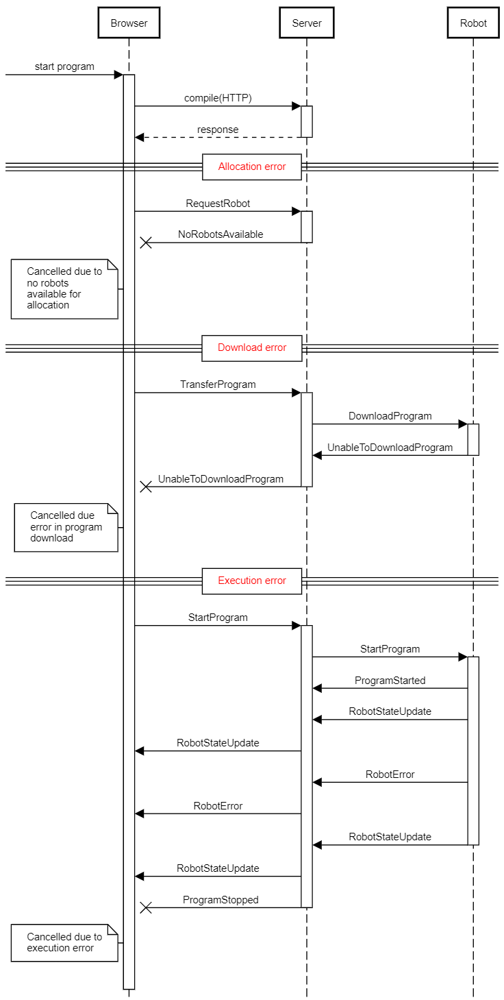

# WebSocket Protocol

This document specifies the communications protocol used for communciations between a robot and the server when using the websocket protocol.

**TODO:** this page is a stub. Need to document this sometime.

## Command Sequences

These sequences are used at specific times in the communications process.

### Initialisation

When the robot first starts, it will need to authenticate with the server and register its details.

### Program Execution

This sequence occurs when a user wants to execute a program. The following sequence shows normal activation and execution:

The following errors can occur during the process:

