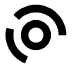
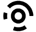

# Tangibles

The KareNao blocks are physical blocks that use functionality defined as per the block based components of the `Naoblocks.net` project via TopCodes. A PDF containing all available TopCodes can be found [here](./images/tangibles/topcodes.pdf). The technical mapping of TopCodes to actions can be found in [this part of the project](../client/src/app/tangible-editor/tangible-editor.component.ts).

## 2020 Part IV Project TopCode Mappings

| TopCode | Action | TopCode Number |
|---------|--------|----------------|
|  | Stand | 31 |
|  | Stand & Speak | 47 |
|  | "Hello" | 55 |
|  | Dance | 59 |
|  | Wave | 61 |
|  | Point Right | 79 |
|  | Point Left | 93 |
|  | Look Right | 109 |
|  | Look Left | 117 |
|  | Walk | 121 |
|  | Rest | 233 |

## 2020 Naoblocks.net TopCode Mappings

| TopCode | Action | TopCode Number |
|---------|--------|----------------|
|  | Stand | 31 |
|  | Wave | 47 |
|  | Dance | 55 |
|  | Dance | 59 |
|  | Wave | 61 |
|  | Rest | 93 |
|  | Sit | 157 |
|  | Sit | 185 |
|  | Point Left | 199 |
|  | Point Left | 227 |
|  | Lie Down | 283 |
|  | Walk | 301 |
|  | Point Right | 313 |
|  | "Kia Ora" | 331 |
|  | Walk | 361 |
|  | "Kia Ora" | 421 |
|  | Lie Down | 433 |

## 2021 Prototype 1 TopCode Mappings

| TopCode | Action | TopCode Number |
|---------|--------|----------------|
|  | Stand | 31 |
|  | Dance | 55 |
|  | Dance | 59 |
|  | Rest | 93 |
|  | Sit | 157 |
|  | Sit | 185 |
|  | Walk | 301 |
|  | Walk | 361 |
|  | Condition1 | 87 |
|  | Condition2 | 91 |
|  | Not | 103 |
|  | And | 107 |
|  | Or | 115 |
|  | For | 143 |
|  | For# | 151 |
|  | EndFor | 155 |
|  | IfElse | 167 |
|  | EndIf | 171 |
|  | EndElse | 173 |
|  | Function | 179 |
|  | UseFunction | 181 |
|  | While | 203 |
|  | EndWhile | 205 |
