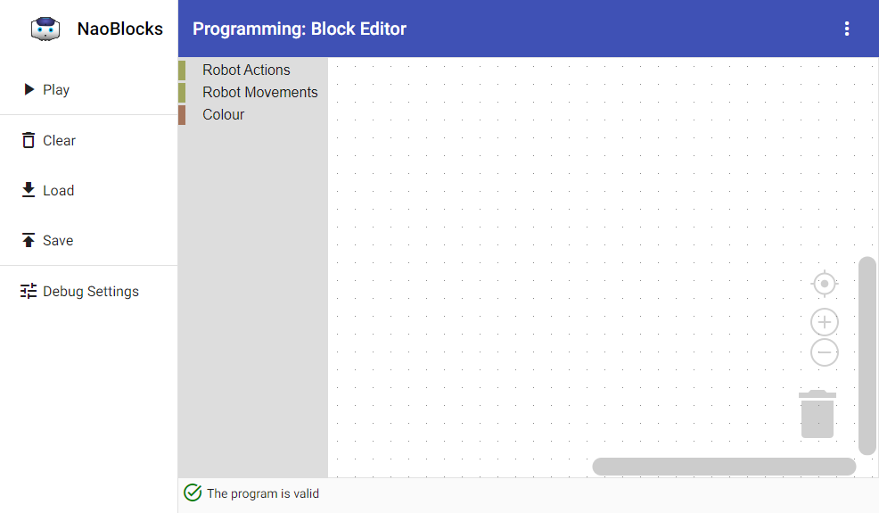
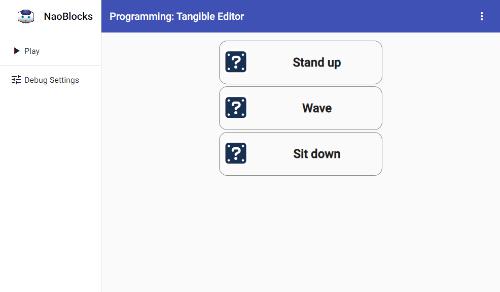

# NaoBlocks.Net

Welcome to the NaoBlocks.Net project.

I'd like to tell you about how wonderful the project is, but it is a research project. We are in the process of tidying things up and making them better. But for now, this project is still very much a work in progress...

Some initial documentation:
* [Running NaoBlocks.Net](Documentation/Running.md)
* [User Interfaces](Documentation/UserInterfaces.md)
* [Data Exports](Documentation/Data.md)
* [Robot Configuration](Documentation/Robots.md)
* [Project Layout](Documentation/ProjectLayout.md)
* [Available Robot Commands](Documentation/Commands.md)
* [Research Publications](Documentation/Publications.md)

## Editors

NaoBlocks.Net currently offers two editors.

### Blockly (Angular) Editor

The Blockly editor is a Scratch-like programming environment. The user will need to drag and drop blocks on the workspace:

### Tangible Editor

The Tangible editor uses computer vision to detect physical (tangible) blocks. These are recognised and displayed in the workshop:

